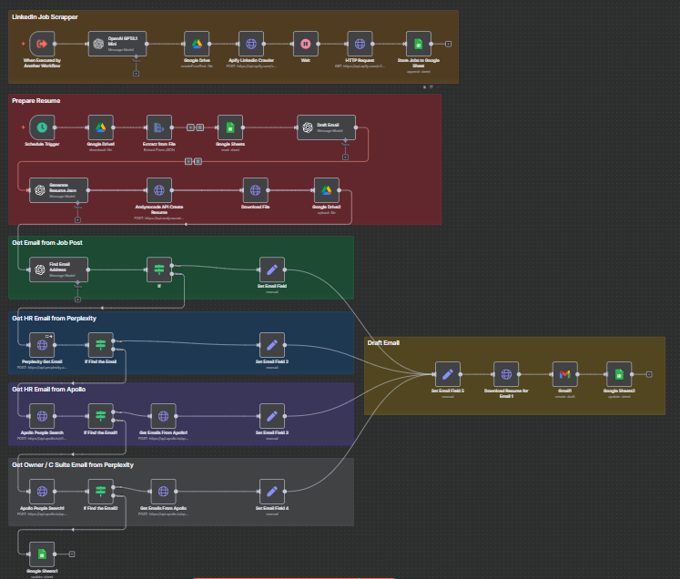

Job Application Automation

Automate your entire job application workflow — from finding jobs on LinkedIn to tailoring resumes, drafting cover letters, and sending emails — all managed in n8n with integrations to LinkedIn, GitHub, Google Sheets, Google Drive, Gmail, Apify, Apollo.io, Perplexity, and OpenAI.

📌 Features

🔍 Job Scraping
Crawl LinkedIn jobs (via Apify) using keywords and locations.

📝 Resume Generation

Fetch user profiles from GitHub and LinkedIn.

Convert into JSON Resume format.

Tailor resumes to match specific job descriptions using OpenAI.

✉️ Cover Letter Drafting
Generate concise, persuasive email-style cover letters aligned with job postings.

📊 Google Sheets Integration

Store all job postings with metadata (company, description, poster info, etc.).

Track application status (sent flag).

📂 Google Drive Integration
Save raw resume JSONs and generated resume PDFs.

📧 Automated Email Sending

Find HR/recruiter email addresses (via Apollo.io, Perplexity, or extracted job details).

Send tailored emails with attached resumes through Gmail.

🏗 Workflow Overview

Trigger

Start when a chat message is received or another workflow calls this one.

Profile Collection

Fetch GitHub and LinkedIn profiles + repositories.

Job Crawling

Scrape jobs from LinkedIn with Apify.

Store results in Google Sheets.

Resume Generation

Convert user data into JSON Resume.

Tailor it for each job posting.

Generate PDF resumes with Andynocode API.

Cover Letter Drafting

Create customized, professional emails per job.

HR Email Extraction

Attempt multiple strategies:

Extract from job posting

Search via Apollo.io

Query Perplexity AI

Application Submission

Attach tailored resume.

Send email to HR/recruiter via Gmail.

Update status in Google Sheets.

⚙️ Setup Instructions
1. Prerequisites

n8n
 installed and running.

API keys for:

Apify (LinkedIn scrapers)

OpenAI

Apollo.io

Perplexity AI (optional for fallback HR email lookup)

Google Cloud (for Sheets, Drive, Gmail integrations)

2. Import Workflow

Load Job Automation.json into your n8n instance.

3. Configure Credentials

Add credentials for:

Google Sheets & Drive

Gmail

Apify

Apollo.io

OpenAI

Perplexity AI

4. Set Google Sheet

Provide a Google Sheet with a job tab.

Ensure columns like:
id, title, companyName, companyWebsite, jobPosterName, email_to, sent, email_content

5. Run Workflow

Trigger via chat input (keywords, location, LinkedIn/GitHub profile).

Workflow will handle job search, resume tailoring, and application email automation.

📂 Project Structure

Job Automation Guide.pdf → Documentation & workflow usage guide.

Job Automation.json → n8n workflow definition.

🚀 Roadmap

Add support for more job boards (Indeed, Glassdoor).

Improve email validation & enrichment.

Multi-theme resume generation.

Dashboard for job tracking.

